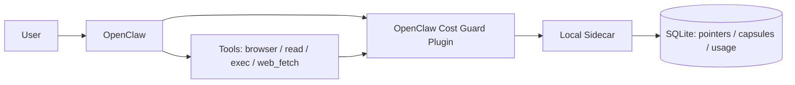
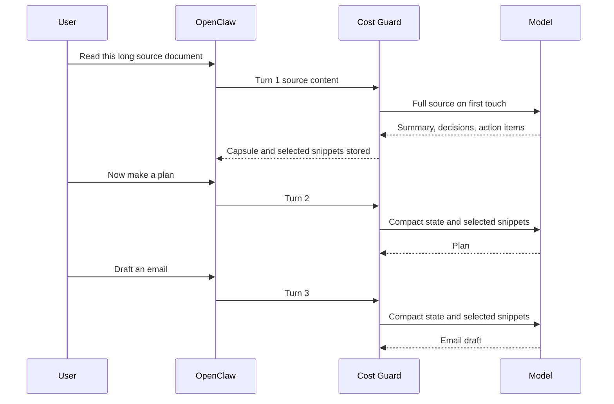

# Cost Guard for OpenClaw

Cost Guard is a closed-source, local-first context governance layer for OpenClaw.
It reduces input-token waste by preserving user-requested source fidelity on first
touch, compressing noisy tool output, and preventing meaningless full-source replay
in later turns.

This repository is the public release repository for Cost Guard. It contains product
documentation, release notes, checksums, and licensing terms. It does not contain
the private source code for Cost Guard.

## What CostGuard Does

Cost Guard sits around OpenClaw's normal agent workflow and reduces input-token
waste without trying to replace OpenClaw, the model provider, or a full retrieval
system.

It is designed for multi-turn, tool-heavy workflows where cost grows because large
tool outputs and already-consumed source materials keep getting replayed.

Core behavior:

- **First-touch fidelity**: user-requested source material stays intact on first read.
- **Later-turn compact**: later turns carry compact state instead of replaying full source bodies.
- **Tool noise compression**: large browser dumps, logs, JSON/YAML dumps, and repeated transient errors are compacted into structured summaries, pointers, and excerpts.
- **Usage visibility**: enough usage data is recorded to show where prompt growth and token burn are coming from.
- **Fail-open integration**: OpenClaw keeps working if Cost Guard is unavailable.

## Where It Runs

Cost Guard runs locally as an OpenClaw plugin plus a local sidecar.



In Preview, the OpenClaw plugin lives under `plugin/openclaw-cost-guard-plugin`
inside each extracted bundle and the sidecar artifact lives at
`runtime/sidecar/app.jar`.

## Content Policy

Cost Guard does not treat all content equally.

| Class | Used for | Examples |
|---|---|---|
| Protected | Content that should not be degraded by default | user-authored prompts, explicitly requested local files, explicitly requested web pages, first-touch source-of-truth material |
| Soft-compress | Reusable but non-critical large context | search result lists, already-consumed long pages, repeated comparison candidates, reusable summaries and snippets |
| Hard-compress | High-volume, low-value noise | exec output, logs, large JSON/YAML dumps, browser snapshots, repeated transient tool/network errors, agent-generated intermediate artifacts |

## First-Touch Fidelity, Later-Turn Compact



On first touch, the model is allowed to actually read the source material. On later
turns, Cost Guard stops replaying the full source body and instead carries forward
compact state, selected snippets, and source locators.

## Preview Capabilities

| Capability | What it does | Preview default |
|---|---|---|
| First-touch fidelity | Keeps user-requested source material intact on first read | Yes |
| Later-turn compact | Prevents replaying full source text in later turns | Yes |
| Tool result pointerization | Replaces large noisy tool outputs with pointer, excerpt, and metadata | Yes |
| Repeated error aggregation | Folds repeated 429/5xx/timeout/network failures into compact summaries | Yes |
| Usage visibility | Shows prompt growth and token burn signals | Yes |
| Level 0 pointers | Metadata and excerpt based pointer records | Yes |
| Level 2 recoverability | Recoverable plaintext with explicit opt-in | Advanced |
| Pointer retrieval/search | Retrieval over pointer-backed content | Preview / Advanced |
| Full RAG | Cross-document retrieval | Not included |

Preview-default controls in the shipped profile templates include:

- `ROUTER_ENABLED=false`
- `POLICY_ENGINE_ENABLED=true`
- `PROTECTED_FIRST_TOUCH_ENABLED=true`
- `LATER_TURN_COMPACT_ENABLED=true`
- `SOFT_COMPRESS_ENABLED=true`
- `HARD_COMPRESS_ENABLED=true`
- `TOOL_PERSIST_ENABLED=true`
- `CAPSULES_ENABLED=true`
- `REPEATED_ERROR_AGGREGATION_ENABLED=true`

## Token-Savings Examples

These examples show input-token behavior across five-turn workflows. Turn 1 is
similar in all modes because source material still needs to be read. Savings appear
from Turn 2 onward, when Cost Guard stops replaying the largest raw tool outputs and
replaces them with compact state, pointers, excerpts, and selected snippets.

### Scenario A: Multi-Turn Current-Events Research

| Turn | Baseline | Observe-only | Full |
|---:|---:|---:|---:|
| 1 | 6,643 | 6,643 | 6,661 |
| 2 | 63,045 | 57,655 | 9,558 |
| 3 | 65,401 | 60,661 | 12,664 |
| 4 | 66,014 | 61,265 | 13,486 |
| 5 | 66,453 | 61,737 | 14,042 |

- 5-turn total reduction versus observe-only: `77.25%`
- Turns 2-5 reduction versus observe-only: `79.38%`

### Scenario B: Long-Document Analysis and Follow-Up Drafting

| Turn | Baseline | Observe-only | Full |
|---:|---:|---:|---:|
| 1 | 6,612 | 6,612 | 6,630 |
| 2 | 39,055 | 72,715 | 11,008 |
| 3 | 39,973 | 73,727 | 12,440 |
| 4 | 40,562 | 74,257 | 13,135 |
| 5 | 41,673 | 75,139 | 14,215 |

- 5-turn total reduction versus observe-only: `81.01%`
- Turns 2-5 reduction versus observe-only: `82.83%`

## Best Fit

Cost Guard is strongest in:

- multi-turn, tool-heavy workflows;
- long-document workflows;
- news and research synthesis;
- log-heavy, browser-heavy, and read-heavy agent sessions;
- repeated reuse of the same source material across turns.

Cost Guard is not primarily aimed at:

- output-token-heavy generation;
- single-turn short prompts;
- full RAG over large corpora;
- replacing dense retrieval for pinpoint extraction in huge documents.

## Distribution Model

- OpenClaw is required and is not bundled in this repository
- Cost Guard is distributed as binary release assets
- Source code is not published
- Use of the software is governed by [EULA.md](EULA.md)

## Quick Start

1. Install OpenClaw and verify the `openclaw` CLI is available.
2. Open the repository `Releases` page and download the archive for your platform.
3. Extract the archive.
4. Run the platform install script from the extracted bundle root.
5. Start the bundled sidecar.
6. Restart the OpenClaw gateway or daemon so the plugin is reloaded.
7. Verify status with the included `status` and `doctor` scripts.

High level example for macOS and Linux:

```sh
cd <bundle-root>
./scripts/unix/install.sh
./scripts/unix/start.sh
./scripts/unix/status.sh
./scripts/unix/doctor.sh
openclaw gateway restart
```

## Repository Layout

- [`docs/install.md`](docs/install.md): installation and first run
- [`docs/configuration.md`](docs/configuration.md): config paths, runtime behavior, and local state
- [`docs/profiles.md`](docs/profiles.md): profile behavior and tuning intent
- [`docs/compatibility.md`](docs/compatibility.md): supported platforms and prerequisites
- [`docs/troubleshooting.md`](docs/troubleshooting.md): common failures and recovery steps
- [`docs/faq.md`](docs/faq.md): commercial and operational FAQ
- [`docs/release-process.md`](docs/release-process.md): suggested GitHub release workflow
- [`CHANGELOG.md`](CHANGELOG.md): public release history
- [`releases/`](releases/): tracked checksums and release metadata

## Current Release Line

The current published preview line is `0.1.0-preview`.

Tracked checksums for the current preview artifacts are in [`releases/0.1.0-preview/SHA256SUMS.txt`](releases/0.1.0-preview/SHA256SUMS.txt).

## Support Boundaries

Cost Guard is designed to be installed on top of an existing OpenClaw setup. The release bundle manages the Cost Guard plugin and sidecar, but it does not install or manage OpenClaw itself.

If you are evaluating commercial use, deployment at team scale, or a support arrangement, document those terms outside this repository in your release notes, website, or sales materials.

## License

This repository and the distributed software are proprietary.

- Repository rights notice: [LICENSE](LICENSE)
- Binary usage terms: [EULA.md](EULA.md)
- Third-party notices: [THIRD_PARTY_NOTICES.md](THIRD_PARTY_NOTICES.md)
